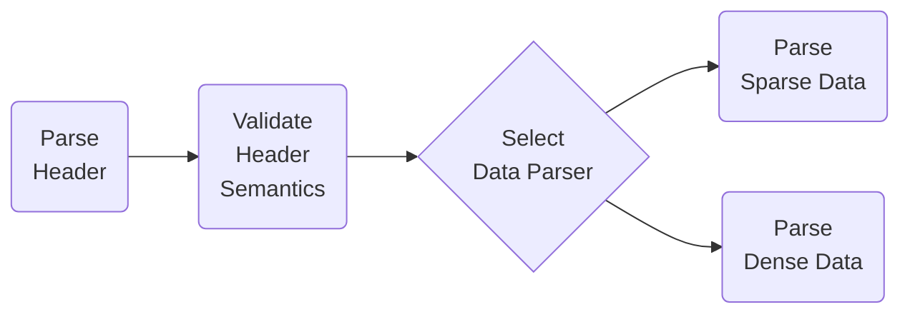

# PX 2013 machine readable specification

As guessed by reading 
the [specs](https://www.scb.se/globalassets/vara-tjanster/px-programmen/px-file_format_specification_2013.pdf),
a bunch of [PX data files](https://github.com/search?q=AXIS-VERSION+KEYS+extension%3Apx&type=Code),
and [PXWeb code](https://github.com/statisticssweden/PCAxis.Core/blob/master/PCAxis.Core/Parsers/PXFileParser.vb).

## PX file parse process

Our objective is to be able to open, parse, and process a PX file of multiple 
hundreds of megabytes with only a few hundred kilobytes of `malloc`'d memory.

So we have to process the file as a continuous stream, while only saving important 
metadata in memory, or we have to first create an index of the PX file in a 
separate disk file, and use that index to randomly access the PX file contents.



### 1. Parse the Header

#### Single-byte or multi-byte

We don't know whether the file consists of single-byte or multi-byte (UTF-8) characters,
until we've parsed the first few rows of PX headers. In those first few rows, we should
encounter the `CODEPAGE` header, which will indicate this. 

The PX 2013 standard suggests that you SHOULD follow a particular order for the header 
rows, which would guarantee that while reading those first few rows of headers up to 
and including the `CODEPAGE` header, all characters should be single byte, and would
practically be within the ASCII range.

While the PX 2013 standard doesn't mandate this, it appears that the major PX file
producers do follow the suggestion.

#### Newlines and whitespaces

You can't have newlines, either `\n`, `\r` or `\r\n`, inside quoted header strings.

Whitespace here means the characters `' '` (space), `'\n'` (newline), `'\r'`

In the headers, whitespace outside quoted strings is not meaningful,
and can be ignored and those characters dropped. The standard does not
discuss whitespace inside non-quoted strings, so I'm assuming that this
has to be preserved.

In the dense data section, whitespace outside quoted strings is meaningful,
and denotes the end of a data item, which would mean either a number, or a
`DATASYMBOL{1-6,NIL}` marking. While it might appear that the PX producer
implementations use `\n` to mark the end of a data row, that's just an
implementation detail which you cannot rely on. You have to count items.

In the sparse data section (KEYS), the `STUB` part of each row follows
the quotation and comma separation rules specified in section 3.2.2.2 of
the PX 2013 standard, and the `HEADING` part of the row follows the 
dense data rules.

#### Header value types.

1\. Plain number.

If the header value consists solely of `[0-9]` and `[\.]` (decimal, dot)
and `[-]` (minus) characters until the end-of-row `;`, it's a valid plain number.

2\. Non-quoted string.

If the header value does not begin with the `"` (quote) character,
and does not contain any `"` (quote) characters or newlines until
the end-of-row `;`, it's a valid non-quoted string.

3\. Quoted string list.

If the header value begins with the `"` (quote) character, and the
keyword was not `HIERARCHY`, it must parse into a valid quoted string list.

A quoted string list consists of one or more quoted strings separated
by the `,` (comma) character.

```text
QSL1="A","B","C";
```

An individual quoted string begins with a `"` quote character,
followed by zero or more characters which do not include the 
`"` quote character (there is no character escaping in the standard)
or the newline characters `\n` or `\r`, and terminated by a `"` quote
character.

You can break an individual quoted string list member into multiple rows,
and this means semantically that you concatenate all quoted string list
item parts which are separated by a newline.

```text
QSL2="aaa"
"AAA",
"B","CCC"
"222";
```

Or as a hexlified byte array

```
51 53 4C 32 3D 22 61 61 61 22 0A 22 41 41 41 22 2C 0A 22 42 22 2C 22 43 43 43 22 0A 22 32 32 32 22 3B 0A
```

In the example QSL2, the final string list will parse into ["aaaAAA", "B", "CCC222"].

4\. `TIMEVAL` variant of the quoted string list.

To be written.

5\. `HIERARCHY` variant of the quoted string list.

To be written.


### 2. Parse the Data

There are two ways for laying out the data stored in a PX file. One for dense 
data cubes, where most data rows have cells with values, and one for sparse 
data cubes, where few of the potential data rows described by the space have 
values. Both methods allow for streaming parsing, one data matrix row at a time.

The dense data cube data layout has each and every data cell potentially described 
by the `STUB × HEADING` matrix space laid out, separated by spaces, with missing 
values especially marked as such.

The sparse data cube data layout identifies each data cube coordinate by laying out
the data row by row, separated by EOL markers, and starting each row by describing 
a set of `STUB` space coordinates, followed by a whitespace character (" ") separator, 
followed by the data cell values for that data matrix row. 
