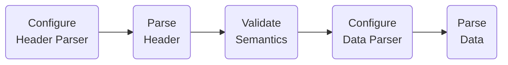

# PX 2013 machine readable specification

As guessed by reading 
the [specs](https://www.scb.se/globalassets/vara-tjanster/px-programmen/px-file_format_specification_2013.pdf),
a bunch of [PX data files](https://github.com/search?q=AXIS-VERSION+KEYS+extension%3Apx&type=Code),
and [PXWeb code](https://github.com/statisticssweden/PCAxis.Core/blob/master/PCAxis.Core/Parsers/PXFileParser.vb).

## PX file parse process

Our objective is to be able to open, parse, and process a PX file of multiple 
hundreds of megabytes with only a few hundred kilobytes of `malloc`'d memory.

So we have to process the file as a continuous stream, while only saving important 
metadata in memory, or we have to first create an index of the PX file in a 
separate disk file, and use that index to randomly access the PX file contents.



### 1. Configure the Header Parser

To configure the header parser, we need three pieces of information:

A. are the EOL marks `\r\n`, `\n`, or something else.

B. what the character encoding of the file is.

C. what specification version the file purports to follow.

The specification says nothing explicit about the end of line markings in the files.
Typically, the EOLs will be Windows ("\r\n"), and the character encoding (`CODEPAGE`) is `"Windows-1252"`.
However, Google searches reveal that there are PX files in the wild with `CODEPAGE="UTF-8";`.

The specification is silent as to the possibility of PX files beginning with 
UTF-8 or UTF-16 BOM markers.

Open the file (as binary), and read 64 bytes (not characters) from the beginning 
of the file with a simple naive read.

Check whether the first bytes are `CHARSET="ANSI";` followed by `\r\n`. If so, 
that's the EOL marking you will use for the rest of the parse.

Read the first five lines, and check for `CODEPAGE` and `AXIS-VERSION` keywords. 
Save the values for those keywords to the header parser context.

### 2. Parse the Header

```ebnf
header row = keyword , "=" , values , ";" , EOL ;
```

```ebnf
keyword = basekey , [ language ] , [ subkeys ] ;

basekey = "A".."Z" , { "A".."Z" | "0".."9" | "-" } ;

language = "[" , 2 * ( "a".."z" ) , "]" ;

subkeys = "(" , quoted-string-list , ")" ;
```

You have to order choices in a certain way for a left-recursive parser,
the order here is only a implementation detail.

```ebnf
values =
        integer
       | tlist-value
       | bare-string
       | hierarchy-levels
       | multiline-quoted-string-list
       ;

bare-string = { all characters - ( ";" | '"' ) }- ; (* one or more character *)

multiline-quoted-string =
        ( quoted-string , EOL , quoted-string , { EOL , quoted-string } )
       | quoted-string
       ;

quoted-string-list = quoted-string , { "," , quoted-string } ;

multiline-quoted-string-list =
        multiline-quoted-string , { "," , [ EOL ] , multiline-quoted-string } ;
```

Specials:

```ebnf
tlist-value =
        "TLIST(" , time-scale , [ quoted-string , "-" , quoted-string ] , ")"
          , [ "," , [ EOL ] , multiline-quoted-string-list ] ;

time-scale = "A1" | "H1" | "Q1" | "M1" | "W1" ;

hierarchy-levels =
        quoted-string , "," , quoted-string , ":" , quoted-string ,
                      { "," , [ EOL ] , quoted-string , ":" , quoted-string } ;
```

Quoted strings in this format have no escaping whatsoever, you simply cannot express
the quote character as content in a PX string.

```ebnf
quoted-string = '"' , { all characters - '"' } , '"' ;

all characters = ? all visible characters ? ;

integer = [ "-" ] , "0".."9" , { "0".."9" } ;

EOL = "\r\n" | "\n" ;
```

### 3. Configure the Data Parser

### 4. Parse the Data

There are two ways for laying out the data stored in a PX file. One for dense 
data cubes, where most data rows have cells with values, and one for sparse 
data cubes, where few of the potential data rows described by the space have 
values. Both methods allow for streaming parsing, one data matrix row at a time.

The dense data cube data layout has each and every data cell potentially described 
by the `STUB × HEADING` matrix space laid out, separated by spaces, with missing 
values especially marked as such.

The sparse data cube data layout identifies each data cube coordinate by laying out
the data row by row, separated by EOL markers, and starting each row by describing 
a set of `STUB` space coordinates, followed by a whitespace character (" ") separator, 
followed by the data cell values for that data matrix row. 
